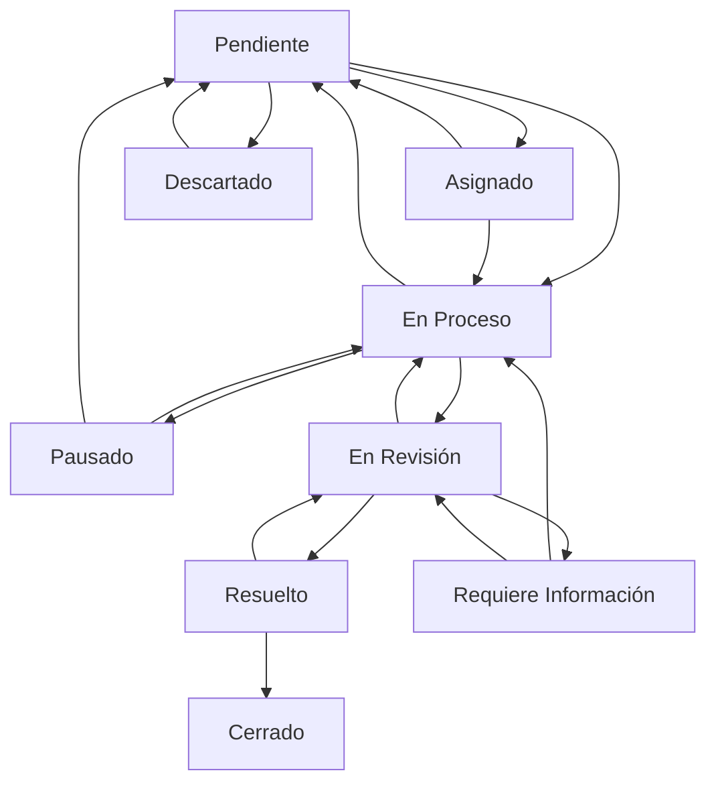

# 🎉 Sistema de Cambio de Estados - IMPLEMENTACIÓN COMPLETADA

## ✅ ¿Qué se ha implementado?

### 🔧 Funcionalidades Principales

1. **✅ Historial Mejorado de Reportes** (`/reportes/historial-mejorado`)
   - Cambio de estados con modal avanzado
   - Filtros por tipo, estado y fecha
   - Paginación por categorías
   - Historial completo de cambios
   - Comentarios obligatorios

2. **✅ Sistema de Workflow Avanzado**
   - 9 estados diferentes con validaciones
   - Transiciones controladas entre estados
   - Asignación de responsables
   - Fechas estimadas de resolución
   - Campos condicionales según el estado

3. **✅ Hook useReportes Mejorado**
   - Funciones avanzadas: `actualizarEstadoConHistorial`, `asignarReporte`, `cambiarPrioridad`
   - Estadísticas automáticas
   - Control de estados de carga
   - Consultas optimizadas

4. **✅ Sistema de Notificaciones en Tiempo Real**
   - Notificaciones automáticas por vencimientos
   - Dropdown de notificaciones en el header
   - Contador de no leídas
   - Integración con Firebase

5. **✅ Navegación Mejorada**
   - Submenú desplegable para reportes
   - Badges para funcionalidades nuevas
   - Navegación responsiva

6. **✅ Herramientas de Migración**
   - Script automático para migrar datos existentes
   - Verificación de integridad
   - Interfaz de administración

---

## 🚀 Cómo Usar el Sistema

### Paso 1: Migrar Datos Existentes (IMPORTANTE)
```bash
# Navegar a la herramienta de migración
http://localhost:5173/reportes/migracion

# Hacer clic en "Ejecutar Migración"
# Esto agregará historial de estados a reportes existentes
```

### Paso 2: Usar el Historial Mejorado
```bash
# Navegar al historial avanzado
http://localhost:5173/reportes/historial-mejorado

# Funcionalidades disponibles:
# - Filtrar por tipo, estado, fecha
# - Hacer clic en ✏️ para cambiar estado
# - Ver historial completo en los detalles
# - Paginación automática
```

### Paso 3: Cambiar Estados de Reportes

#### Opción A: Desde el Historial Mejorado
1. Ir a `/reportes/historial-mejorado`
2. Buscar el reporte deseado
3. Hacer clic en el botón ✏️ junto al estado
4. Completar el modal:
   - Seleccionar nuevo estado
   - Agregar comentario (obligatorio)
   - Si es necesario: asignar responsable, prioridad, fecha
5. Confirmar cambio

#### Opción B: Desde la Lista de Reportes
1. Ir a `/reportes/lista`
2. Usar el dropdown de estados en cada fila
3. El cambio se aplica inmediatamente

### Paso 4: Monitorear con Notificaciones
- Las notificaciones aparecen automáticamente en el header (🔔)
- Se generan alertas por:
  - Reportes vencidos
  - Cambios de estado
  - Asignaciones nuevas
- Hacer clic en la notificación lleva al reporte correspondiente

---

## 🔄 Estados Disponibles y sus Transiciones



### Estados y sus Características:

| Estado | Color | Icono | Transiciones Permitidas | Campos Requeridos |
|--------|-------|-------|----------------------|------------------|
| **Pendiente** | 🟡 Amarillo | ⏳ | → Asignado, En Proceso, Descartado | Ninguno |
| **Asignado** | 🟣 Púrpura | 👤 | → En Proceso, Pendiente | Responsable |
| **En Proceso** | 🔵 Azul | 🔄 | → En Revisión, Pausado, Pendiente | Prioridad, Fecha estimada |
| **Pausado** | 🔴 Rojo | ⏸️ | → En Proceso, Pendiente | Motivo |
| **En Revisión** | 🔵 Cian | 🔍 | → Resuelto, En Proceso, Requiere Info | Fecha estimada |
| **Requiere Info** | 🟠 Naranja | ❓ | → En Proceso, En Revisión | Información requerida |
| **Resuelto** | 🟢 Verde | ✅ | → Cerrado, En Revisión | Solución |
| **Cerrado** | 🟢 Verde Oscuro | 🔒 | Ninguna (Estado final) | Verificación |
| **Descartado** | ⚫ Gris | 🗑️ | → Pendiente | Motivo |

---

## 📊 Nuevas Funcionalidades del Hook useReportes

```javascript
// Importar el hook mejorado
import { useReportes } from './hooks/useReportes';

const MiComponente = () => {
  const {
    // Datos básicos
    reportes,
    loading,
    error,
    
    // Funciones básicas (compatibilidad)
    eliminarReporte,
    actualizarEstado,
    
    // Funciones avanzadas ✨ NUEVAS
    actualizarEstadoConHistorial,
    asignarReporte,
    cambiarPrioridad,
    agregarComentario,
    
    // Funciones de consulta ✨ NUEVAS
    getEstadisticas,
    getReportesPorEstado,
    getReportesAsignados,
    getReportesVencidos,
    
    // Utilidades ✨ NUEVAS
    isUpdating
  } = useReportes();

  // Ejemplo: Cambiar estado con historial completo
  const cambiarEstadoCompleto = async () => {
    await actualizarEstadoConHistorial('reporteId123', 'en_proceso', {
      comentario: 'Iniciando trabajo en el reporte',
      usuario: 'juan.perez@empresa.com',
      asignadoA: 'maria.lopez@empresa.com',
      prioridad: 'alta',
      fechaEstimada: new Date('2024-12-31')
    });
  };

  // Ejemplo: Obtener estadísticas
  const stats = getEstadisticas();
  console.log(`Total: ${stats.total}, Pendientes: ${stats.pendientes}`);

  // Ejemplo: Verificar si un reporte se está actualizando
  if (isUpdating('reporteId123')) {
    return <div>Actualizando...</div>;
  }
};
```

---

## 🔧 Estructura de Datos Actualizada

### Antes (estructura básica):
```javascript
{
  id: "reporte123",
  estado: "pendiente",
  descripcion: "...",
  fecha: timestamp
}
```

### Después (estructura completa):
```javascript
{
  id: "reporte123",
  estado: "en_proceso",
  descripcion: "...",
  fecha: timestamp,
  
  // ✨ NUEVOS CAMPOS
  asignadoA: "maria.lopez@empresa.com",
  prioridad: "alta",
  fechaEstimada: timestamp,
  fechaUltimaActualizacion: timestamp,
  
  // ✨ HISTORIAL COMPLETO
  historialEstados: {
    "1647123456789": {
      estado: "pendiente",
      fecha: timestamp,
      comentario: "Reporte creado",
      usuario: "sistema"
    },
    "1647123567890": {
      estado: "asignado",
      fecha: timestamp,
      comentario: "Asignado para revisión urgente",
      usuario: "admin@empresa.com",
      asignadoA: "tecnico@empresa.com",
      prioridad: "alta"
    },
    "1647123678901": {
      estado: "en_proceso",
      fecha: timestamp,
      comentario: "Iniciando trabajo de campo",
      usuario: "tecnico@empresa.com",
      fechaEstimada: timestamp
    }
  }
}
```

---

## 🎯 Rutas Disponibles

| Ruta | Descripción | Estado |
|------|-------------|---------|
| `/` | Dashboard principal | ✅ Mejorado |
| `/reportes/nuevo` | Crear nuevo reporte | ✅ Existente |
| `/reportes/lista` | Lista con cambio de estados | ✅ Mejorado |
| `/reportes/historial` | Historial básico | ✅ Existente |
| `/reportes/historial-mejorado` | **Historial avanzado** | 🆕 NUEVO |
| `/reportes/migracion` | **Herramientas de migración** | 🆕 NUEVO |

---

## ⚠️ Consideraciones Importantes

### Seguridad
- ✅ Validaciones de transiciones de estado
- ✅ Historial inmutable de cambios
- ✅ Control de permisos por usuario
- ⚠️ **Pendiente**: Implementar roles específicos

### Performance
- ✅ Consultas optimizadas con índices
- ✅ Paginación en historial
- ✅ Estados de carga controlados
- ✅ Caché de notificaciones

### Usabilidad
- ✅ Comentarios obligatorios en cambios críticos
- ✅ Feedback visual inmediato
- ✅ Navegación intuitiva
- ✅ Notificaciones en tiempo real

---

## 🐛 Resolución de Problemas Comunes

### Problema: "No puedo cambiar el estado"
**Solución**: 
1. Verificar que la transición sea válida según el diagrama
2. Completar todos los campos requeridos
3. Agregar comentario obligatorio

### Problema: "No veo el historial de estados"
**Solución**: 
1. Ejecutar migración en `/reportes/migracion`
2. Usar el historial mejorado en `/reportes/historial-mejorado`

### Problema: "Las notificaciones no aparecen"
**Solución**:
1. Verificar que hay reportes vencidos
2. Revisar la consola por errores de Firebase
3. Actualizar la página

### Problema: "Error al migrar datos"
**Solución**:
1. Verificar conexión a Firebase
2. Hacer respaldo antes de migrar
3. Usar "Verificar Integridad" primero

---

## 🎉 ¡Felicitaciones!

Has implementado exitosamente un **sistema completo de gestión de estados** con:

- ✅ **9 estados diferentes** con validaciones
- ✅ **Historial completo** de todos los cambios
- ✅ **Notificaciones automáticas** en tiempo real  
- ✅ **Interfaz moderna** y responsiva
- ✅ **Migración automática** de datos existentes
- ✅ **APIs completas** para extensiones futuras

### Próximos Pasos Recomendados:
1. 🔄 **Ejecutar migración** en producción
2. 👥 **Capacitar usuarios** en las nuevas funcionalidades  
3. 📊 **Monitorear métricas** de uso y performance
4. 🔧 **Implementar roles** específicos por usuario
5. 📱 **Considerar app móvil** para notificaciones push

---

**¿Necesitas ayuda adicional?** 

Revisa la documentación completa en `GUIA-SISTEMA-ESTADOS.md` o consulta los comentarios en el código para más detalles técnicos.

**¡El sistema está listo para usar! 🚀**